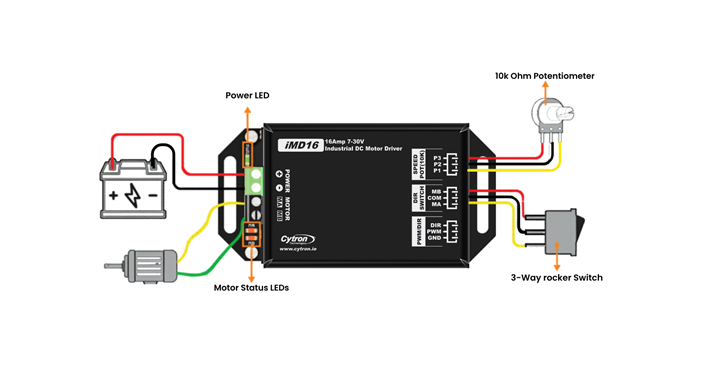

::: titlepage

------------------------------------------------------------------------

\

------------------------------------------------------------------------

\
**Cytron iMD16 Notes\
and a Cheap Campus Delivery Robot Idea** \

------------------------------------------------------------------------

\
**Reman Dey**\
**First-Year, Engineering Physics**\
**Indian Institute of Technology Mandi**\

------------------------------------------------------------------------

\
**June 2026**\

  --------------------- -----------------------------------------------
  **Document Type:**    Project Proposal (Club Submission)
  **Hardware Focus:**   Cytron iMD16 Motor Driver
  **Project:**          Low-Cost Campus Delivery Robot/Campus Cleaner
  **Advisor:**          AeroXMD
  **Campus:**           IIT Mandi, Himachal Pradesh
  --------------------- -----------------------------------------------

------------------------------------------------------------------------

\

------------------------------------------------------------------------
:::

# Why I'm Writing This

This is my project proposal for the Robotronics Club. I'm just a
first-year so I don't have a huge budget or a lot of hands-on experience
yet, so I picked something I think I can actually build this semester.

The report has two parts. First I go through the Cytron iMD16 motor
driver in some detail because that's the one part of the system I'm most
confident about and it's the part I had to actually understand the math
for. Second, I sketch out a small delivery-/cleaning robot idea that
uses this driver, but built around parts that are actually affordable
for a student club, not industrial-grade sensors.

I want to be upfront that this is a scaled-down, \"let's get something
working\" proposal,

not a finished engineering design. Things like exact battery sizing, the
camera FOV, and the final BOM will probably change once I start testing.

# Some Basic Motor Math

Before picking a driver I wanted to actually understand what a DC motor
driver is doing, not just treat it as a black box, so here's the model I
worked through.

## The Two Equations

A brushed DC motor is basically an electrical circuit (the coil)
connected to a spinning mechanical part (the shaft + whatever load is on
it). You get one equation from circuit theory and one from rotational
mechanics.

**Electrical side (Kirchhoff's voltage law around the motor coil):**

$$\begin{equation}
    V(t) = R\,i(t) + L\,\frac{di(t)}{dt} + e_b(t)
    \label{eq:kvl}
\end{equation}$$

where $V$ is the voltage the driver applies, $R$ is the coil resistance,
$L$ is the coil inductance, $i$ is the current, and $e_b$ is the
back-EMF (the voltage the spinning motor generates on its own, opposing
the current).

**Mechanical side (Newton's second law for rotation):**

$$\begin{equation}
    T_m(t) = J\,\frac{d\omega(t)}{dt} + B\,\omega(t) + T_L(t)
    \label{eq:newton}
\end{equation}$$

where $T_m$ is the torque the motor produces, $J$ is the rotational
inertia, $\omega$ is the angular speed, $B$ is friction, and $T_L$ is
whatever load torque is fighting the motor (gravity on a slope,
friction, etc).

## Connecting Them

Torque and back-EMF are both tied to a single motor constant $K$:

$$\begin{align}
    T_m(t) &= K \cdot i(t) \\
    e_b(t) &= K \cdot \omega(t)
\end{align}$$

## What Happens at Steady State

If you let the motor settle (no more change in current or speed), the
derivative terms drop out and you can solve for current from
Eq. [\[eq:kvl\]](#eq:kvl){reference-type="eqref" reference="eq:kvl"}:

$$\begin{equation}
    i_{ss} = \frac{V - K\,\omega}{R}
\end{equation}$$

Plug that into the torque equation and you get the torque--speed line
for the motor:

$$\begin{equation}
    T_m(\omega) = \frac{K}{R}\,V - \frac{K^2}{R}\,\omega
    \label{eq:tm_omega}
\end{equation}$$

This is the one equation I actually care about, because it tells you the
motor's torque goes down linearly as speed goes up -- which makes sense,
since a faster-spinning motor generates more back-EMF, which fights the
current, which lowers torque.

Two useful numbers come out of this:

$$\begin{equation}
    T_\text{stall} = \frac{K}{R}\,V \quad \text{(torque at zero speed, max current)}
\end{equation}$$

$$\begin{equation}
    \omega_0 = \frac{V}{K} \quad \text{(top speed at zero load)}
\end{equation}$$

**Why this matters for picking a driver:** the driver basically controls
$V$ by chopping the supply voltage on and off really fast (PWM).
Changing the duty cycle shifts this whole torque-speed line up or down,
which is how you get speed control.

# Cytron iMD16 -- What It Actually Is

## Specs (from the datasheet)

::: {#tab:imd16_specs}
  **Parameter**                **Value**                 **Why it matters**
  ---------------------------- ------------------------- ------------------------------------------
  Operating voltage            7--30 V DC                Works with 12 V or 24 V batteries
  Continuous current           16 A per channel          Plenty for a small wheelchair-size motor
  Peak current                 30 A (under 10 s)         Headroom for starting torque / bumps
  Logic input                  3--30 V                   Works directly off a Pi's 3.3 V GPIO
  PWM frequency (ext.)         up to 20 kHz              Quiet, doesn't whine
  Reverse polarity protect     Yes                       Saves me if I wire the battery backwards
  Overcurrent/thermal cutoff   Yes                       Won't fry itself if a wheel jams
  Size                         $83\times57\times29$ mm   Small enough to mount easily

  : Cytron iMD16 -- Key Specs
:::

{#fig:sojdfsjf
width="100%"}

## Things I Like About It

- **It's enclosed.** A lot of the cheaper drivers (L298N boards etc.)
  are just bare PCBs. The iMD16 is in a metal case, which seems like a
  good idea given how much it rains here and how dusty the paths get.

- **Logic level is flexible.** It can take anywhere from 3 V to 30 V on
  the signal pins, so I don't need any extra level-shifting circuitry
  between it and a Raspberry Pi (which outputs 3.3 V).

- **Built-in protection.** Reverse polarity and overcurrent protection
  mean I'm less likely to destroy it by wiring something wrong, which,
  being honest, is a real risk for me right now.

## Things to Watch Out For

{#fig:placeholder width="100%"}

- **No software config.** Everything (braking mode, current limits) is
  set by jumpers/screw terminals, not firmware. So I can't change
  braking behaviour on the fly from code -- I'd have to physically
  rewire it.

- **No current sensing feedback.** It doesn't tell my code how much
  current it's drawing, so I can't easily detect a stalled wheel in
  software. I'd need to add an external current sensor (like an ACS712
  module, which is cheap, around Rs. 150) if I want that later.

- **Braking energy.** If a heavy motor is decelerated suddenly, some
  energy gets pushed back into the supply. With a basic SMPS power
  supply this could trip an overvoltage fault. Running off a battery
  instead (which I'm planning to do anyway) mostly avoids this because
  batteries can absorb that little kick of energy.

## Is It Overkill or Underpowered for What I Want?

I did a rough sanity check on the lower and upper ends of what this
driver could possibly be used for, mostly just so I understood the scale
of things.

**Upper end -- could it drive something like an electric bus motor?**
No, not even close. A bus traction motor needs on the order of
150,000 W. The iMD16 tops out around:

$$\begin{equation}
    P_\text{max} = 30\,\text{V} \times 16\,\text{A} = 480\,\text{W}
\end{equation}$$

That's about 300 times too small. Obviously nobody would actually try
this, but it helped me get a feel for where the iMD16 sits.

**Lower end -- is it overkill for a small campus robot?** Not really. A
small wheelchair-motor-class robot pulling a parcel pannier needs maybe
1--3 A per motor under normal driving and a short burst higher than that
going up a slope. 16 A continuous and 30 A peak per channel is actually
a comfortable margin, not overkill, especially since I want some safety
margin for the steep bits of campus.

**Conclusion for my project:** the iMD16 is a good fit for a small 12 V
or 24 V brushed-motor robot. It would be wrong for anything bigger
(e-rickshaw scale and up needs a completely different, 3-phase BLDC
controller).

# Other Drivers I Looked At

For completeness, here are a couple of other options I found while
researching, in case the iMD16 turns out to not be available or I need
something cheaper/bigger later.

::: {#tab:competitive}
  **Driver**       **Rough Price**   **Notes**
  ---------------- ----------------- -------------------------------------------------------------------------------------------------------------------------------------------------------------------------------------------------
  Cytron MD20A     Rs. 2000          Delivers 20A continuously and 60A peak. This model includes convenient manual testing buttons, excellent thermal management (no heatsink required), and works with standard PWM and DIR inputs.
  BTS7960 module   Rs. 300--400      Higher current (\~43 A claimed) but bare board, no protection
  Cytron iMD16     \~Rs. 3,200       What I'm proposing -- enclosed, protected, good logic range
  Cytron MDDS30    \~Rs. 5,500       smartdrive, more current, probably overkill for now

  : Other Motor Driver Options
:::

Honestly the L298N is what most people start with because it's so cheap,
but I've read that it has a pretty bad voltage drop across the H-bridge
transistors (no protection diodes/MOSFETs the way iMD16 has), which
wastes power and gets hot. Since the club already has a couple of iMD16
units sitting around from a previous project, I'm planning to just reuse
one of those rather than buying anything new for this part.

# Basic Robot Steering Math (Skid-Steer)

## The Idea

The robot is a simple 4-wheel skid-steer design (think small tank, no
steering wheels). You turn by spinning the left and right wheels at
different speeds. It's mechanically simple -- no servo steering linkage
to build.

<figure id="fig:kinematics_geom" data-latex-placement="ht">

<figcaption>4-wheel skid-steer layout. Left side wheels and right side
wheels each move together.</figcaption>
</figure>

## The Equations

Let $v_L$ and $v_R$ be the left and right side wheel speeds, $b$ be half
the track width, and $r$ the wheel radius. The robot's forward speed $v$
and turn rate $\dot{\psi}$ are:

$$\begin{equation}
    v = \frac{v_R + v_L}{2}, \qquad \dot{\psi} = \frac{v_R - v_L}{2b}
    \label{eq:fwd}
\end{equation}$$

And going the other way, if I know what forward speed and turn rate I
want, I can solve for the wheel speeds I need to command:

$$\begin{equation}
    v_R = v + b\,\dot{\psi}, \qquad v_L = v - b\,\dot{\psi}
    \label{eq:inv}
\end{equation}$$

Then divide by wheel radius $r$ to get angular speed, and divide by the
motor's no-load speed $\omega_0$ (from Section 2) to get a PWM duty
cycle between 0 and 100%.

## Quick Numeric Example

Say $b = 0.25$ m, $r = 0.075$ m (small wheel),
$\omega_0 \approx 10$ rad/s. I want to drive forward at $v = 0.3$ m/s
while turning gently at $\dot{\psi} = 0.2$ rad/s.

$$\begin{align*}
    v_R &= 0.3 + 0.25 \times 0.2 = 0.35\,\text{m/s} \\
    v_L &= 0.3 - 0.25 \times 0.2 = 0.25\,\text{m/s}
\end{align*}$$

Converting to wheel angular speed ($\div r$) and then duty cycle
($\div \omega_0$):

$$\begin{align*}
    \omega_R &= 0.35/0.075 = 4.67\,\text{rad/s} \rightarrow D_R = 46.7\% \\
    \omega_L &= 0.25/0.075 = 3.33\,\text{rad/s} \rightarrow D_L = 33.3\%
\end{align*}$$

That's basically the whole control loop -- read a desired speed/turn
command, do this math, send two PWM values to the driver.

# The Actual Robot Proposal

## What I'm Trying to Build

A small delivery cart that can move along a fixed, pre-mapped route
around a part of campus (not the whole campus -- something more like one
hostel block to one academic block to start) carrying a small parcel.
I'm *not* trying to do full outdoor SLAM or GPS navigation in version 1.
That's a lot harder than it sounds, and honestly outside what I can
debug right now as a first-year. Instead I want to use simple markers
(basically big printed QR-code-like tags called ArUco markers) stuck
along the route as landmarks, which is a well-documented
beginner-friendly approach.

## Why I Dropped the Fancy Hardware

My first draft of this proposal had a Jetson Orin Nano, an OAK-D Pro
depth camera, GPS, and four separate iMD16 drivers -- which added up to
almost Rs. 1.75 lakh. That's not realistic for a first project, both
budget-wise and skill-wise. So I cut it down hard:

- **Jetson Orin Nano $\rightarrow$ Raspberry Pi.** A Pi 4 (or Pi 5 if
  the club already owns one) is more than enough to run OpenCV's ArUco
  detector and a simple control loop. I don't need real-time YOLO
  segmentation for a slow indoor-ish delivery cart on a known path.

- **OAK-D Pro depth camera $\rightarrow$ regular USB webcam.** I just
  need to see ArUco markers and maybe do basic obstacle blob detection,
  not full depth sensing. A normal Rs. 800 webcam can do this fine for
  version 1.

- **4$\times$ iMD16** Instead of one driver per wheel, I'll wire
  left-side motors together and right-side motors together (like most
  small skid-steer kits do) and drive them off the two channels of a
  single iMD16. This is a downgrade in flexibility (no independent
  per-wheel torque vectoring) but it's a totally reasonable tradeoff for
  a v1 robot, and it's the one piece of hardware the club already has.

- **GPS module $\rightarrow$ dropped entirely.** Wasn't needed even in
  the original plan since the route is fixed, but now it's extra
  obviously unnecessary.

## Rough System Sketch

``` {.bash language="bash" caption="What's running on the Pi (rough plan, not final)"}
- webcam_node          : grabs frames from the USB webcam
- aruco_node           : runs OpenCV ArUco detection on each frame
- motor_node           : takes a simple (forward_speed, turn_rate) command
                         and sends PWM + direction to the iMD16
- main_loop            : if marker is visible -> steer toward it
                         if no marker -> go straight slowly, look for one
```

I'm planning to write this in plain Python with OpenCV first, not full
ROS 2. ROS 2 is genuinely useful but it's a lot of extra infrastructure
to learn for a robot this small, and I think I'll understand my own code
better if I write the control loop directly. I might revisit ROS 2 in a
v2 once I'm more comfortable.

## Driving the Motors

Each iMD16 channel takes a PWM signal plus a direction pin. The Pi's
GPIO pins run at 3.3 V logic which is within the iMD16's 3--30 V input
range, so no extra level shifter is needed.

``` {.python language="Python" caption="Rough motor control sketch"}
def set_motor(pwm_pin, dir_pin, speed):
    # speed is -1.0 to 1.0
    GPIO.output(dir_pin, GPIO.HIGH if speed >= 0 else GPIO.LOW)
    duty = abs(speed) * 100.0
    pwm_pin.ChangeDutyCycle(duty)

def drive(v, omega, b=0.25, r=0.075, w0=10.0):
    # v: forward speed (m/s), omega: turn rate (rad/s)
    v_r = v + b * omega
    v_l = v - b * omega
    speed_r = (v_r / r) / w0
    speed_l = (v_l / r) / w0
    set_motor(PWM_R, DIR_R, speed_r)
    set_motor(PWM_L, DIR_L, speed_l)
```

## Safety

Since this is a slow, small robot on a known path (not 24 kg+ moving at
speed), I'm not planning anything fancy here -- just:

- A physical kill switch on the battery line I can hit by hand.

- Software speed cap so it never drives faster than walking pace.

- Basic \"stop if marker not seen for N seconds\" fallback so it doesn't
  wander off blindly.

A proper wireless e-stop system would be a nice v2 addition but it's not
something I can justify spending money on right now.

# Budget

This is the part I rewrote the most. Trying to keep the whole thing
under Rs. 30,000, using parts the club either already has or that are
easy to get from a local electronics shop / Amazon / Robu.in.

## Bill of Materials

::: {#tab:bom}
+-------------------+---------+--------------+--------------+--------------+
| **Item**          | **Qty** | **Notes**    | **Unit       | **Total      |
|                   |         |              | (Rs.)**      | (Rs.)**      |
+:==================+========:+:=============+=============:+=============:+
| *(continued)*                                                            |
+-------------------+---------+--------------+--------------+--------------+
| **Item**          | **Qty** | **Notes**    | **Unit       | **Total      |
|                   |         |              | (Rs.)**      | (Rs.)**      |
+-------------------+---------+--------------+--------------+--------------+
| Cytron iMD16      | 4       | Already      | 0            | 0            |
| driver            |         | owned by the |              |              |
|                   |         | club (Rs. 0  |              |              |
|                   |         | if reused)   |              |              |
+-------------------+---------+--------------+--------------+--------------+
| 12 V DC geared    | 4       | Cheap        | 450          | 1,800        |
| motor (300 RPM)   |         | hobby-grade  |              |              |
|                   |         | gear motors, |              |              |
|                   |         | left+right   |              |              |
|                   |         | pairs wired  |              |              |
|                   |         | together     |              |              |
+-------------------+---------+--------------+--------------+--------------+
| Wheels (rubber,   | 4       | Matched to   | 120          | 480          |
| 65 mm)            |         | motor shaft  |              |              |
+-------------------+---------+--------------+--------------+--------------+
| 12 V 7 Ah         | 1       | Cheaper than | 1,400        | 1,400        |
| Lead-Acid battery |         | LiFePO$_4$,  |              |              |
|                   |         | fine for v1, |              |              |
|                   |         | club may     |              |              |
|                   |         | already have |              |              |
|                   |         | a spare      |              |              |
+-------------------+---------+--------------+--------------+--------------+
| Raspberry Pi 4    | 1       | Or reuse one | 5,500        | 5,500        |
| (4 GB)            |         | from club    |              |              |
|                   |         | inventory if |              |              |
|                   |         | available    |              |              |
+-------------------+---------+--------------+--------------+--------------+
| MicroSD card      | 1       | For Pi OS    | 400          | 400          |
| (32 GB)           |         |              |              |              |
+-------------------+---------+--------------+--------------+--------------+
| USB webcam (720p) | 1       | For ArUco    | 800          | 800          |
|                   |         | marker       |              |              |
|                   |         | detection    |              |              |
+-------------------+---------+--------------+--------------+--------------+
| ArUco markers     | 15      | Print at     | 30           | 450          |
| (printed,         |         | campus print |              |              |
| laminated)        |         | shop,        |              |              |
|                   |         | laminate at  |              |              |
|                   |         | a local shop |              |              |
+-------------------+---------+--------------+--------------+--------------+
| 12 V to 5 V buck  | 1       | Powers the   | 200          | 200          |
| converter         |         | Pi off the   |              |              |
|                   |         | main battery |              |              |
+-------------------+---------+--------------+--------------+--------------+
| Jumper wires +    | 1 set   | Prototyping  | 250          | 250          |
| breadboard        |         |              |              |              |
+-------------------+---------+--------------+--------------+--------------+
| Toggle switch     | 1       | Main power   | 80           | 80           |
| (kill switch)     |         | cutoff       |              |              |
+-------------------+---------+--------------+--------------+--------------+
| Chassis:          | 1       | Cheapest     | 600          | 600          |
| plywood/acrylic   |         | option --    |              |              |
| sheet (cut to     |         | can          |              |              |
| size)             |         | laser-cut at |              |              |
|                   |         | the Fab Lab  |              |              |
|                   |         | if free for  |              |              |
|                   |         | club         |              |              |
|                   |         | projects     |              |              |
+-------------------+---------+--------------+--------------+--------------+
| M3 nuts/bolts +   | 1 set   | General      | 250          | 250          |
| standoffs         |         | assembly     |              |              |
+-------------------+---------+--------------+--------------+--------------+
| Cardboard/plastic | 1       | Reused       | 100          | 100          |
| box for parcel    |         | container,   |              |              |
| bay               |         | basically    |              |              |
|                   |         | free         |              |              |
+-------------------+---------+--------------+--------------+--------------+
| Wiring (random    | ---     | Hopefully    | 300          | 300          |
| gauge, from club  |         | scavenged    |              |              |
| stock)            |         | from club    |              |              |
|                   |         | leftovers    |              |              |
+-------------------+---------+--------------+--------------+--------------+
| **Subtotal**                                              | **12,610**   |
+-----------------------------------------------------------+--------------+

: Budget BOM -- Campus Delivery Robot v1
:::

## Summary

::: {#tab:bom_summary}
  **Item**                                  **Cost (Rs.)**
  --------------------------------------- ----------------
  Subtotal (parts above)                            12,610
  Contingency / mistakes buffer (\~40%)              5,040
  **Total**                                     **17,650**

  : Budget Summary
:::

I put a fairly large 40% contingency on this because, realistically, I'm
going to burn out a motor driver pin or fry something testing this for
the first time, and I'd rather plan for that honestly than pretend I'll
get it right on the first try. Even with that buffer the total comes to
under Rs. 18,000, well inside the Rs. 30,000 target, and if the Pi and
iMD16 are both already available from the club's inventory, the real
out-of-pocket cost could be closer to Rs. 7,000--8,000.

## What I Cut Out (and might add back later)

- **Depth camera / 3D perception** -- not needed for marker-following on
  a fixed route.

- **GPS/RTK** -- not needed for the same reason, and was never needed
  even in the original full-scale idea.

- **Per-wheel motor drivers** -- one driver with paired channels is
  enough for v1; can revisit if I want real torque vectoring later.

- **LiFePO$_4$ battery** -- a basic lead-acid battery is heavier and
  less efficient but much cheaper and something the club may already
  have lying around.

- **Wireless e-stop** -- relying on a physical switch for now.

# Why I Think This Fits the Club

I know this is a much smaller and less impressive-sounding project than
something with a Jetson and a depth camera, but I think that's actually
the point for a first-year project -- I want to build something I can
fully understand and debug myself, on a budget that doesn't need special
approval, using a driver (the iMD16) that the club already has sitting
around. If it works, scaling it up later with a better camera, more
drivers, or a move to ROS 2 seems like a natural next step instead of
something I have to get right on day one.

# Conclusion

To sum up what's in this report:

1.  Worked through the basic DC motor equations
    (Eqs. [\[eq:kvl\]](#eq:kvl){reference-type="eqref"
    reference="eq:kvl"}--[\[eq:tm_omega\]](#eq:tm_omega){reference-type="eqref"
    reference="eq:tm_omega"}) to actually understand what the driver is
    doing instead of treating it as a black box.

2.  Went through the Cytron iMD16 spec sheet and figured out where it
    fits (good for a small 12--24 V robot, way too small for anything
    vehicle-scale).

3.  Looked at a couple of cheaper/pricier alternatives for context
    (L298N, BTS7960, MDDS30).

4.  Worked out the skid-steer kinematics
    (Eqs. [\[eq:fwd\]](#eq:fwd){reference-type="eqref"
    reference="eq:fwd"}--[\[eq:inv\]](#eq:inv){reference-type="eqref"
    reference="eq:inv"}) needed to convert a forward-speed/turn-rate
    command into wheel PWM values.

5.  Put together a stripped-down, budget version of the original
    delivery-robot idea: Raspberry Pi instead of Jetson, a regular
    webcam instead of a depth camera, one iMD16 instead of four, and
    ArUco markers instead of GPS -- bringing the total cost down from
    about Rs. 1.75 lakh to under Rs. 18,000.

::: center

------------------------------------------------------------------------

\
*Submitted to the Robotronics Club for review -- heppy to get feedback
and revise.*\

------------------------------------------------------------------------
:::
